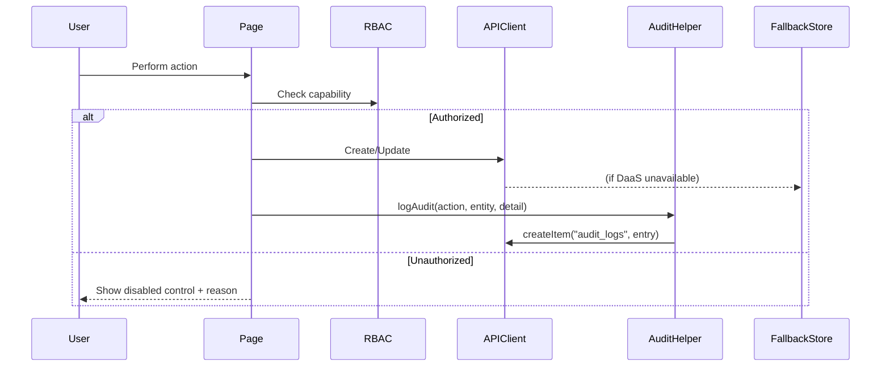

# Design Document: BatchNexus Submission Upgrade

## Overview

This design covers the comprehensive update package for BatchNexus Control Tower ahead of the CyberHack 2026 submission for Sima Arôme. The upgrade spans five groups: bug fixes & consistency (A), manual controls (B), UI/UX redesign (C), enterprise readiness (D), and stretch features (E), plus cross-cutting concerns for AI fallback and data compatibility.

The architecture preserves the existing Next.js 16 App Router + React 19 + Mantine stack while introducing:
- A unified data-driven notification and dashboard system
- Policy-validated manual override flows with audit trails
- Vertical-flow QC redesign for improved readability
- Strengthened RBAC alignment between routes and capabilities
- Deterministic AI fallback on every AI path

**Key Design Decisions:**
1. **No new external dependencies** — all changes use existing libraries (Mantine, Tabler Icons, dayjs, zod).
2. **Fallback-first architecture** — every feature must work with `lib/demoStore.ts` alone.
3. **Audit-by-default** — critical actions write to `audit_logs` collection via a shared `logAudit()` helper.
4. **RBAC-gated UI** — controls are disabled (not hidden) for unauthorized roles, with tooltip explanations.

## Architecture

```mermaid
graph TB
    subgraph "Client (Browser)"
        Pages[App Router Pages]
        SharedUI[Shared Components]
        RBAC[lib/rbac.ts]
        VisionQC[lib/visionQC.ts]
    end

    subgraph "Data Layer"
        APIClient[lib/api/client.ts]
        FallbackStore[lib/demoStore.ts]
        SeedData[lib/demoData.ts]
    end

    subgraph "API Routes"
        Proxy[/api/items/*]
        AIRoutes[/api/ai/*]
    end

    subgraph "External (Optional)"
        DaaS[DaaS Backend]
        AIService[AI Service - Groq/Google]
    end

    Pages --> SharedUI
    Pages --> RBAC
    Pages --> APIClient
    Pages --> VisionQC
    APIClient --> Proxy
    APIClient -->|fallback| FallbackStore
    FallbackStore --> SeedData
    Proxy --> DaaS
    AIRoutes --> AIService
    AIRoutes -->|fallback| FallbackStore
```

### Module Interaction Flow



## Components and Interfaces

### New Shared Utilities

#### `lib/audit.ts` — Audit Logger
```typescript
interface AuditEntry {
  timestamp: string;
  actor: string;
  role: string;
  action: string;
  entity: string;
  change_detail: string;
}

function logAudit(role: UserRole, action: string, entity: string, changeDetail: string): Promise<void>
```

#### `lib/notifications.ts` — Data-Driven Notification Engine
```typescript
interface Notification {
  id: string;
  type: "cold-chain" | "audit" | "pending-qc" | "policy-violation";
  title: string;
  message: string;
  source_entity: string;
  timestamp: string;
  read: boolean;
}

function deriveNotifications(zones: Zone[], auditLogs: AuditEntry[], receipts: Receipt[]): Notification[]
```

#### `lib/slotValidation.ts` — Policy Validation Engine
```typescript
interface SlotValidationResult {
  valid: boolean;
  violations: PolicyViolation[];
}

interface PolicyViolation {
  type: "hazard" | "temperature" | "quarantine";
  message: string;
  zone_id: string;
}

function validateSlotAssignment(lot: Lot, zone: Zone, bin: Bin): SlotValidationResult
```

#### `lib/summaryEngine.ts` — Deterministic Summary Generator
```typescript
interface OperationsSummary {
  sections: ModuleSummary[];
  kpis: KPI[];
  attentionItems: AttentionItem[];
  recommendations: Recommendation[];
  generated_at: string;
}

function generateDeterministicSummary(db: DemoDB): OperationsSummary
```

### Updated Components

#### `components/Layout/TopBar.tsx`
- Replace hardcoded notifications with `deriveNotifications()` output
- Add unread count badge driven by actual unread items
- Add "Mark all read" functionality persisted to localStorage

#### `components/shared/SlotPanel.tsx` (new)
- Displays AI Slot_Recommendation
- Provides manual bin/zone selector with policy validation
- Requires reason field when override differs from recommendation
- Calls `logAudit()` on save

#### `components/shared/ManualEntryForm.tsx` (new)
- Form with fields: supplier, material, quantity, unit, batch_reference, arrival_date, temperature_requirement, hazard_class
- Validates material/supplier against `materials` and `suppliers` collections
- Uses Mantine form with zod schema validation
- No AI dependency

#### `components/shared/ViewToggle.tsx` (new)
- Reusable list/grid toggle with active indicator
- Used on Inbound page

#### `components/shared/ActionMenu.tsx` (new)
- Reusable row action menu (Mantine Menu)
- Stops event propagation on trigger click
- Configurable menu items

#### `components/shared/EmptyState.tsx` (new)
- Consistent empty state component with icon, title, description
- Used across all modules

#### `components/shared/HumanInTheLoopBadge.tsx` (new)
- Badge/indicator showing "Human decision required" on AI outputs
- Consistent across QC, slotting, summary surfaces

### Page Updates

| Page | Changes |
|------|---------|
| `app/inbound/page.tsx` | Add ViewToggle, ActionMenu on rows, grid card view |
| `app/inbound/new/page.tsx` | Add Manual_Entry path toggle alongside AI extraction |
| `app/qc/page.tsx` | Vertical flow layout, consistent field schema write, source_receipt_id on lot creation |
| `app/warehouse/page.tsx` | SlotPanel with manual override, acknowledge cold-chain alert |
| `app/page.tsx` (Dashboard) | Data-driven AI Insight card, data-driven cold-chain banner |
| `app/summary/page.tsx` | Enriched summary with KPIs, attention items, recommendations, export |
| `app/lots/page.tsx` | Display linked receipt/QC data via source_receipt_id, recall simulation (stretch), genealogy graph (stretch) |
| `app/audit/page.tsx` | No functional change, RBAC alignment fix |
| `components/Layout/TopBar.tsx` | Data-driven notifications |

### RBAC Alignment Fix

Current issue: `ROLE_ACCESS` gives QC Staff access to `/audit`, but `canViewAudit("QC Staff")` returns false. Fix: remove `/audit` from QC Staff's route list in `ROLE_ACCESS`.

```typescript
// Before
"QC Staff": ["/", "/qc", "/lots", "/audit", "/copilot"],
// After
"QC Staff": ["/", "/qc", "/lots", "/copilot"],
```

## Data Models

### Updated Collections Schema

#### `lots` (updated)
```typescript
interface Lot {
  id: string;
  lot_number: string;
  source_receipt_id: string;  // Links to receipt that originated this lot
  receipt_id: string;         // Backward-compatible field
  material_id: string;
  quantity: number;
  status: "Awaiting Slot" | "Stored" | "Dispatched" | "Quarantine";
  current_location: string | null;
  released_at: string;
  date_created: string;
}
```

#### `qc_inspections` (canonical schema)
```typescript
interface QCInspection {
  id: string;
  receipt_id: string;
  colour_score: number;           // 0-100 numeric
  defect_risk: "Low" | "Medium" | "High";
  foreign_matter_risk: "Low" | "Medium" | "High";
  recommendation: "Pass" | "Pass with human review" | "Block Material";
  confidence: number;             // 0-1 fractional
  human_decision: "QC Released" | "Blocked" | "Recheck";
  reason_codes: string[];
  inspected_by: string;
  date_created: string;
  inspected_at: string;
}
```

#### `audit_logs` (unchanged, enforced)
```typescript
interface AuditLog {
  id: string;
  timestamp: string;
  date_created: string;
  actor: string;        // From getActorName(role)
  role: string;
  action: string;
  entity: string;
  change_detail: string;
}
```

#### `inventory_moves` (updated)
```typescript
interface InventoryMove {
  id: string;
  lot_id: string;
  to_bin_id: string;
  quantity: number;
  moved_by: string;
  date_created: string;
  moved_at: string;
  reason: string;
  assignment_type: "accepted-AI" | "manual-override";  // New field
}
```

#### `notifications` (new, localStorage-only)
```typescript
interface NotificationState {
  items: Notification[];
  last_derived_at: string;
}
```

### SEED_VERSION Strategy

When any of the above schema changes are applied:
1. Bump `SEED_VERSION` in `lib/demoData.ts`
2. Update `INITIAL_DB` with records matching new schema
3. `getDemoDB()` auto-reseeds on version mismatch


## Correctness Properties

*A property is a characteristic or behavior that should hold true across all valid executions of a system — essentially, a formal statement about what the system should do. Properties serve as the bridge between human-readable specifications and machine-verifiable correctness guarantees.*

### Property 1: QC Inspection Schema Consistency

*For any* QC inspection written by the QC module, the record SHALL contain fields `colour_score` (numeric 0–100), `defect_risk`, `foreign_matter_risk`, `recommendation`, `confidence` (numeric 0–1), and `human_decision` with valid values, and *for any* QC inspection displayed by the Lots module (including those with missing fields), the display SHALL never produce the strings "undefined" or "NaN" — using a placeholder "—" for absent values.

**Validates: Requirements 3.1, 3.2, 3.3, 3.4**

### Property 2: Lot-Receipt Linkage Integrity

*For any* lot created from a QC release of a receipt, the lot SHALL have `source_receipt_id` equal to the originating receipt's `id`, and querying the receipt and its QC inspection via that `source_receipt_id` SHALL return the correct supplier, quantity, and inspection data for display.

**Validates: Requirements 4.1, 4.2, 4.3**

### Property 3: Dashboard Data-Driven Content

*For any* set of `lots`, `sample_dispatches`, `warehouse_zones`, and `temperature_readings` records, the Dashboard AI Insight card SHALL derive its content exclusively from those records (no hardcoded identifiers), and the cold-chain banner SHALL display only zones with status "Cold-chain Alert" with their actual temperature values.

**Validates: Requirements 5.1, 5.2, 5.4**

### Property 4: Notification Data Integrity

*For any* set of operational records (Cold_Chain_Alerts, recent audit_logs, receipts with status "Pending QC"), the derived notification list SHALL contain only items sourced from those records, and the unread count SHALL equal the number of notification items not marked as read.

**Validates: Requirements 6.1, 6.2, 6.5**

### Property 5: RBAC Route-Capability Alignment

*For any* role in the system, if `canViewAudit(role)` returns false then `canAccessRoute(role, "/audit")` SHALL also return false, and more generally, for any route with a corresponding capability function, route access SHALL imply capability access.

**Validates: Requirements 7.1, 7.4**

### Property 6: AI Route Fallback Determinism

*For any* retained AI route (`/api/ai/qc-score`, `/api/ai/summary`, `/api/ai/copilot`, `/api/ai/extract-manifest`), when called without a valid API key or when the external AI service is unavailable, the route SHALL return a valid structured response via deterministic fallback logic.

**Validates: Requirements 8.2, 8.4, 15.3**

### Property 7: Slot Policy Validation

*For any* lot with a given hazard class and temperature requirement, and *for any* zone/bin selection, the slot validation engine SHALL reject assignments where the zone's `hazard_policy` does not permit the lot's hazard class OR the zone's temperature range (`temp_min`–`temp_max`) does not encompass the lot's temperature requirement, and SHALL prevent saving such violations.

**Validates: Requirements 9.2, 9.3, 9.7**

### Property 8: Override Requires Reason

*For any* manual slot assignment where the selected bin/zone differs from the AI Slot_Recommendation, the system SHALL require a non-empty reason string before the assignment can be saved.

**Validates: Requirements 9.4**

### Property 9: Slot Assignment Audit Trail

*For any* successful slot assignment (whether accepted-AI or manual-override), the system SHALL create an audit_log entry containing the actor persona, role, target bin, reason (if override), and assignment_type, AND SHALL update the lot's status to "Stored" with `current_location` set to the selected bin.

**Validates: Requirements 9.5, 9.6**

### Property 10: Manual Entry Validation

*For any* manual entry form submission, the system SHALL validate that material and supplier values exist in the `materials` and `suppliers` collections respectively, and SHALL reject submission when any required field (supplier, material, quantity, unit, batch_reference, arrival_date) is empty or invalid.

**Validates: Requirements 10.3, 10.4, 10.5**

### Property 11: Manual Receipt Creation Correctness

*For any* valid manual entry submission, the created receipt SHALL have status "Pending QC" and an audit_log entry SHALL be created with the actor persona, role, action, entity, and change_detail indicating "Manual Entry" as the source.

**Validates: Requirements 10.6**

### Property 12: Summary Content Completeness

*For any* set of operational records, the generated operations summary SHALL contain sections for intake, QC, warehouse, cold-chain, and dispatch, with KPI values derived from actual record counts/statuses, and attention items referencing real record identifiers.

**Validates: Requirements 12.1, 12.2, 12.3, 12.4**

### Property 13: Summary RBAC Enforcement

*For any* role where `canGenerateSummary(role)` returns false, the summary generation action SHALL be blocked, and for roles where it returns true, generation SHALL succeed.

**Validates: Requirements 12.8**

### Property 14: Audit Trail Completeness

*For any* critical action (create, approve, assign, override, dispatch, intake manual, acknowledge), the system SHALL create an audit_log entry containing non-empty `actor` (from `getActorName`), `role`, `action`, `entity`, and `change_detail` fields.

**Validates: Requirements 14.2, 14.6**

### Property 15: Data Layer Offline Resilience

*For any* collection fetch when the DaaS proxy returns an error or empty data, the API client SHALL return data from the Fallback_Store, and *for any* create/update operation when DaaS is unavailable, the change SHALL be persisted to the Fallback_Store.

**Validates: Requirements 15.1, 15.2, 15.4**

### Property 16: Auto-Reseed on Version Mismatch

*For any* stored seed version that is less than the current `SEED_VERSION`, calling `getDemoDB()` SHALL trigger a reseed from `INITIAL_DB` and update the stored version to match `SEED_VERSION`.

**Validates: Requirements 16.2**

### Property 17: View Toggle Data Identity

*For any* array of receipts, rendering in list view and grid view SHALL produce the same set of records in the same order, with the grid card displaying at minimum: batch_reference, material name, supplier, quantity with unit, priority, and status.

**Validates: Requirements 1.5, 1.6**

### Property 18: Recall Impact Derivation (Stretch)

*For any* lot, the recall simulation SHALL return all `sample_dispatches` records where `lot_id` matches the selected lot, listing affected customers and dispatch details.

**Validates: Requirements 17.1, 17.2**

### Property 19: Acknowledge Cold-Chain Side Effects (Stretch)

*For any* zone with status "Cold-chain Alert", acknowledging the alert SHALL update the zone status to indicate the alert has been handled, AND SHALL create an audit_log entry with the actor persona, role, entity (zone ID), and change_detail.

**Validates: Requirements 18.2, 18.3**

### Property 20: Genealogy Graph from Real Records (Stretch)

*For any* lot with a `source_receipt_id`, the genealogy graph SHALL contain upstream nodes (receipt, QC inspection) and downstream nodes (inventory_move, dispatch) derived from records linked via `source_receipt_id` and `lot_id`, with missing stages marked as "not available" rather than producing errors.

**Validates: Requirements 19.1, 19.2, 19.4**


## Error Handling

### Data Layer Errors

| Scenario | Handling |
|----------|----------|
| DaaS proxy returns 4xx/5xx | `fetchItems` catches error, falls back to `fallbackFetch()` with console warning |
| DaaS proxy returns empty data | `fetchItems` detects empty array, falls back to `fallbackFetch()` |
| `fallbackCreate`/`fallbackUpdate` item not found | Throws error, caught by calling component, shows Mantine notification |
| localStorage unavailable (SSR) | `getDemoDB()` returns `INITIAL_DB` directly |

### AI Route Errors

| Scenario | Handling |
|----------|----------|
| AI service timeout/error | Route handler catches, returns deterministic fallback response |
| No API key configured | Route handler detects missing key, returns fallback immediately |
| Malformed AI response | Route handler validates response shape, falls back if invalid |

### Form Validation Errors

| Scenario | Handling |
|----------|----------|
| Manual entry: invalid material/supplier | Zod validation fails, field highlighted with error message |
| Manual entry: missing required fields | Form prevents submission, marks empty fields |
| Slot override: empty reason | Save button disabled until reason is non-empty |
| Slot override: policy violation | Explicit violation message shown, save prevented |

### RBAC Errors

| Scenario | Handling |
|----------|----------|
| Unauthorized route access | Redirect to allowed page OR show "Access Denied" with role explanation |
| Unauthorized action attempt | Control disabled with tooltip explaining required role |
| Role not found in ROLE_ACCESS | Falls back to most restrictive access (Customer Service) |

### UI State Errors

| Scenario | Handling |
|----------|----------|
| QC inspection missing fields | Display "—" placeholder instead of undefined/NaN |
| Empty data for dashboard cards | Show informative empty state component |
| No notifications available | Show "No notifications" state |
| Lot without source_receipt_id | Show "Data not linked" message in Overview/QC tabs |

## Testing Strategy

### Testing Framework

- **Unit/Integration tests**: Vitest (already compatible with Next.js 16 + React 19)
- **Property-based tests**: `fast-check` library with Vitest
- **Component tests**: React Testing Library with Vitest

### Property-Based Testing Configuration

Each property test:
- Runs minimum **100 iterations** per property
- References its design document property via tag comment
- Tag format: `// Feature: batchnexus-submission-upgrade, Property {N}: {title}`

### Test Categories

#### Property Tests (fast-check + Vitest)

| Property | Module Under Test | Generator Strategy |
|----------|-------------------|-------------------|
| P1: QC Schema Consistency | `app/qc/`, `app/lots/` | Generate random QC inspection payloads with valid/invalid/missing fields |
| P2: Lot-Receipt Linkage | `app/qc/`, `app/lots/` | Generate receipts, trigger lot creation, verify linkage |
| P3: Dashboard Data-Driven | `app/page.tsx` | Generate random lots/dispatches/zones, verify dashboard derives from them |
| P4: Notification Integrity | `lib/notifications.ts` | Generate random operational events, verify notification derivation |
| P5: RBAC Alignment | `lib/rbac.ts` | Enumerate all roles × routes × capabilities |
| P6: AI Fallback | `app/api/ai/*` | Call each route with mocked unavailable AI service |
| P7: Slot Policy Validation | `lib/slotValidation.ts` | Generate random lot hazard/temp × zone policy combinations |
| P8: Override Reason Required | `components/shared/SlotPanel.tsx` | Generate override scenarios, verify reason enforcement |
| P9: Slot Audit Trail | Warehouse module | Generate assignments, verify audit + status update |
| P10: Manual Entry Validation | `components/shared/ManualEntryForm.tsx` | Generate form payloads with random valid/invalid fields |
| P11: Manual Receipt Creation | Inbound module | Generate valid entries, verify receipt + audit |
| P12: Summary Completeness | `lib/summaryEngine.ts` | Generate random operational data, verify summary structure |
| P13: Summary RBAC | `app/summary/page.tsx` | All roles × canGenerateSummary |
| P14: Audit Completeness | `lib/audit.ts` | Generate random critical actions, verify entry fields |
| P15: Offline Resilience | `lib/api/client.ts` | Mock DaaS failure, verify fallback read/write |
| P16: Auto-Reseed | `lib/demoStore.ts` | Set old version, verify reseed behavior |
| P17: View Toggle Identity | `app/inbound/page.tsx` | Generate random receipt arrays, verify both views show same data |
| P18: Recall Impact (stretch) | `app/lots/` | Generate lots with random dispatch links |
| P19: Acknowledge (stretch) | `app/warehouse/` | Generate zones with alerts, verify side effects |
| P20: Genealogy Graph (stretch) | `app/lots/` | Generate lots with various link depths |

#### Unit Tests (Vitest)

- RBAC: specific role access examples (QC Staff denied /audit, Admin allowed everywhere)
- QC field display: specific examples with known values
- Dashboard: empty state when no lots/alerts exist
- Notification: "Mark all read" sets count to zero
- Manual entry: specific valid/invalid form examples
- View toggle: active indicator styling

#### Integration Tests

- Full inbound flow: AI extraction → QC release → lot creation → slot assignment
- Manual entry flow: form fill → validation → receipt creation → audit log
- Summary generation: end-to-end with fallback data
- Cold-chain acknowledge flow: alert → acknowledge → status update → audit

### Test File Structure

```
__tests__/
├── properties/
│   ├── qc-schema.property.test.ts
│   ├── lot-linkage.property.test.ts
│   ├── dashboard-data.property.test.ts
│   ├── notifications.property.test.ts
│   ├── rbac-alignment.property.test.ts
│   ├── ai-fallback.property.test.ts
│   ├── slot-validation.property.test.ts
│   ├── slot-override.property.test.ts
│   ├── manual-entry.property.test.ts
│   ├── summary-engine.property.test.ts
│   ├── offline-resilience.property.test.ts
│   ├── auto-reseed.property.test.ts
│   └── view-toggle.property.test.ts
├── unit/
│   ├── rbac.test.ts
│   ├── audit.test.ts
│   ├── notifications.test.ts
│   └── slot-validation.test.ts
└── integration/
    ├── inbound-flow.test.ts
    ├── manual-entry-flow.test.ts
    └── summary-flow.test.ts
```

### Dead Code Cleanup Strategy

For Requirement 8, the following AI routes will be evaluated:
1. `/api/ai/qc-score` — **Retain**: connected to QC module for AI scoring fallback
2. `/api/ai/summary` — **Retain**: connected to Summary module
3. `/api/ai/copilot` — **Retain**: connected to Copilot page
4. `/api/ai/extract-manifest` — **Retain**: connected to Inbound intake AI extraction

Each retained route must have:
- At least one calling module
- A working deterministic fallback (no API key required)
- Proper error handling that returns fallback on any failure

### Implementation Priority (aligned with judging criteria)

1. **Enterprise Readiness (30%)**: RBAC fix, audit trail, policy enforcement, human-in-the-loop badges → Requirements 7, 14, 9
2. **Problem-Solution Fit (20%)**: Data-driven dashboard, notifications, QC schema fix → Requirements 3, 4, 5, 6
3. **UX (20%)**: Vertical QC flow, consistent design pass, view toggle, action menu → Requirements 1, 2, 11, 13
4. **Innovation (20%)**: Enriched AI summary, manual override with policy validation, recall simulation → Requirements 9, 10, 12, 17
5. **Cross-cutting**: AI fallback, data compatibility → Requirements 8, 15, 16
6. **Stretch**: Acknowledge alert, genealogy graph → Requirements 18, 19
