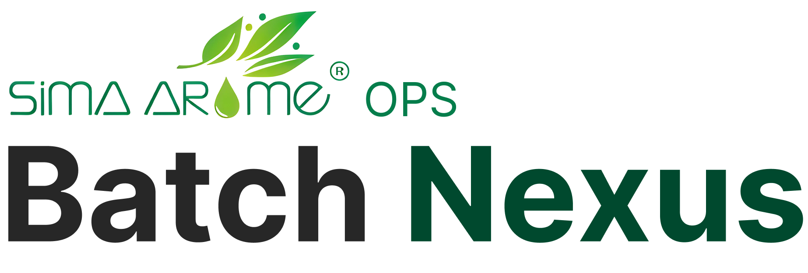
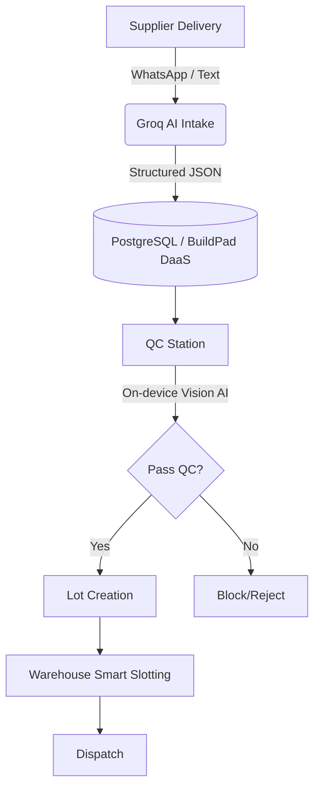

<div align="center">



# BatchNexus Control Tower

**One operational brain for intake, QC, lot tracking, warehouse, and dispatch.**<br>
An AI-assisted manufacturing operations control tower built for **Sima Arôme**.

🏆 **CyberHack 2026 Sima Arôme Manufacturing Innovation Challenge** 🏆

<br>


<br>

### 🔗 Official Submission Links

🌍 **[Live Demo Application](https://main.dix13trs8jql.amplifyapp.com/)** &nbsp; | &nbsp; 📑 **[Pitch Deck Presentation](https://drive.google.com/file/d/11fcIdT7om3cR-50LKPJ_t0gKqQpdLx5f/view?usp=drive_link)** &nbsp; | &nbsp; 🎬 **[Demo Video](https://drive.google.com/file/d/1TTIkyxckptVJMiJfl1JBM6_qfTg5Xw-b/view?usp=drive_link)**

<br>

*Product promise:* **"Input once. Trace everything. Slot safely. Answer instantly."**

</div>

---

## Screenshots & Features Tour

### 1. Dashboard & KPI
*Provides a real-time executive overview of factory operations. Monitors active cold-chain alerts, tracks total pending items across all departments, and delivers AI-generated insights so managers can make data-driven decisions without digging through spreadsheets.*


### 2. AI Inbound Intake
*Eliminates manual data entry errors. Warehouse operators simply paste text or WhatsApp messages from suppliers, and our Groq (Llama 3.1) AI instantly extracts the material, supplier, quantity, and temperature requirements into a structured form.*


### 3. Computer Vision QC
*Revolutionizes quality control with an on-device AI vision engine. It analyzes sample photos pixel-by-pixel to calculate color deviation (ΔE) and detect dark-spot anomalies. It acts as an AI-assisted first inspection layer before final human sign-off.*


### 4. PPIC Production Board
*A visual drag-and-drop Kanban board that transforms production planning. PPIC managers can seamlessly move approved lots into staging, ensuring the production line is always fed with QC-cleared materials.*


### 5. Lot Traceability Timeline
*Solves the biggest compliance headache in manufacturing. Clicking any Lot reveals a visual, end-to-end provenance timeline—tracing exactly when it arrived, who approved the QC, where it was stored, and when it was dispatched.*


### 6. Smart Warehouse Slotting
*Prevents catastrophic storage errors. Features a visual digital twin of the warehouse with drag-and-drop assignment. The system actively enforces hazard segregation rules and cold-chain temperature limits, rejecting unsafe placements instantly.*


### 7. Dispatch & Fulfillment
*Streamlines outbound logistics. Allows operations to quickly pack and dispatch released lots or customer samples, updating inventory levels and generating a final audit trail of the material leaving the facility.*


### 8. Ops Copilot
*A 24/7 intelligent assistant for the factory floor. Instead of navigating menus, staff can ask natural language questions like "Where is Lot 2026-X stored?" and the Copilot instantly retrieves the exact answer from the live operational database.*


### 9. AI Operations Summary
*Automates daily reporting. At the end of the shift, the AI analyzes all operational data, bottlenecks, and alerts to generate a professional "Daily Digest", replacing hours of manual reporting work for the plant manager.*


### 10. Tamper-Evident Audit Log
*A compliance-oriented audit tool aligned with ISO and quality-management practices. Every critical action taken in BatchNexus is audit-logged with the actor, role, timestamp, entity, and change details, and each entry carries a demo tamper-evident hash.*


## The Problem vs The Solution

### The Problem: Operational Blind Spots & Manual Bottlenecks
Sima Arôme produces premium natural extracts where precision is non-negotiable. Yet, daily operations suffer from critical inefficiencies:
- **Data Fragmentation:** Critical data is scattered across WhatsApp, Excel, and paper logbooks, requiring massive double-entry efforts that are prone to human error.
- **Subjective & Slow QC:** Quality Control relies heavily on human eyes to detect color deviations and dark spots, leading to inconsistent standards and severe bottlenecks when lab technicians are overloaded.
- **High-Risk Warehousing:** Placing a highly flammable extract next to an oxidizer, or failing to strictly monitor cold-chain temperatures (-20°C), risks catastrophic safety incidents and product spoilage.
- **Zero Compliance Traceability:** Preparing for an FDA or ISO audit takes weeks of manual paper-chasing to trace a dispatched product back to its raw material supplier.

### The Solution: BatchNexus AI Control Tower
BatchNexus transforms fragmented manual workflows into a **single, intelligent, event-driven source of truth**. 
- **AI-Powered Intake:** Groq NLP (Llama 3.1) instantly structures messy unstructured supplier data into clean digital records, saving hours of manual typing.
- **Computer Vision QC:** On-device visual AI screens sample photos pixel-by-pixel for color variance (ΔE) and defects, acting as an AI-assisted first inspection layer for the lab.
- **Smart, Hazard-Aware Slotting:** A digital warehouse twin mathematically enforces hazard segregation and cold-chain compliance before a drum is ever physically moved.
- **Effortless Traceability:** Critical actions are audit-logged with actor, role, timestamp, entity, and change details, offering 1-click end-to-end provenance tracing that makes compliance audits far faster.


## Installation Steps

Requires **Node.js 18.17+** and **pnpm**.

1. **Clone the repository:**
   ```bash
   git clone https://github.com/milhan-z/draft-batchnexus.git
   cd draft-batchnexus
   ```

2. **Install dependencies:**
   ```bash
   pnpm install
   ```

3. **Environment Configuration (Optional):**
   Create a `.env.local` file. The app runs perfectly in offline/fallback mode without these, but they enable live DaaS and Cloud AI:
   ```env
   # Enables live AI extraction & summaries
   GROQ_API_KEY=your_groq_api_key

   # BuildPad DaaS backend
   NEXT_PUBLIC_BUILDPAD_DAAS_URL=https://29dd52b2-e0be-43c7-a587-2c78d2dc107a.daas4.buildpad.ai
   ```

4. **Run the development server:**
   ```bash
   pnpm dev
   ```
   Open `http://localhost:3000` in your browser.


## Usage Instructions 

To fully experience the BatchNexus capabilities, follow this operational workflow:

1. **Dashboard:** Start here to view high-level plant operations, cold-chain alerts, and the daily AI operations summary.
2. **AI Inbound Intake:** Navigate to `Inbound Intake` -> `New Intake`. Paste supplier text into the AI Assist panel and watch it extract structured receipt fields automatically. Click **Submit to QC**.
3. **QC Release Station:** Navigate to `QC Station`. Select the newly submitted item from the Inspection Queue. View the **Computer-vision photo screening** (colour delta, defect risk) and click **Approve** to generate a Lot.
4. **Lot Traceability:** Go to `Lots` and click on your new Lot to view its full event-based provenance timeline from receipt to QC.
5. **Warehouse Smart Slotting:** Navigate to `Warehouse`. Drag the unassigned Lot from the left panel and drop it into a specific Bin/Zone to assign its location.
6. **Ops Copilot:** Use the chat icon to query the operational database in natural language (e.g., *"Where is Lot 2026-X stored?"*).
7. **Audit Log:** Finally, navigate to `Governance -> Audit Log` to verify that every critical action taken above was audit-logged with actor, role, timestamp, entity, and change details.


## Tech Stack & Architecture

- **Frontend:** Next.js 16 (App Router), React 19, TypeScript, Tailwind CSS v4
- **Backend:** BuildPad DaaS (Data-as-a-Service) / PostgreSQL
- **AI Integration:** 
  - Groq (Llama 3.1) for document extraction & summarization
  - On-device Canvas computer-vision engine (`lib/visionQC.ts`) for color/defect analysis
- **Resilience:** Graceful local Edge fallback (`lib/demoStore.ts`) for high availability even if the DaaS API is unavailable.

> [!TIP]
> 🏆 **Enterprise Readiness via BuildPad DaaS**
> To meet demanding industry standards for auditability, security, and scalability out of the box, the entire backend infrastructure of BatchNexus is powered natively by **BuildPad DaaS**. We intentionally bypassed building a fragile custom backend to leverage BuildPad's robust PostgreSQL architecture, supporting enterprise-readiness patterns aligned with CyberHack's Enterprise Readiness judging criteria.

### System Architecture & Data Flow



---

## User Roles & RBAC

BatchNexus includes a comprehensive Role-Based Access Control (RBAC) system. Depending on the active role, the sidebar navigation, UI buttons, and data access will dynamically adapt. Switch roles from the login page or the topbar to test the permissions:


> [!NOTE]
> **Login Page / Role Selector (Demo Mode)**
> For the purpose of this hackathon, the `/login` page is designed as a passwordless "Role Selector". This allows judges to seamlessly switch between personas and explore different permission states without typing credentials. In a production environment, this page will be integrated with an Enterprise Authentication provider (e.g., Supabase Auth or BuildPad Auth) using encrypted passwords and Single Sign-On (SSO).

| Persona | Role / Function | Permissions & Capabilities |
|---|---|---|
| 👨‍🔧 **Dimas Pratama** | **Receiving Operator** | Access to `Inbound Intake`. Can upload DOs, use AI extraction, and submit raw materials to the QC queue. Cannot approve QC. |
| 👩‍🔬 **Rani Wulandari** | **QC Staff** | Access to `QC Station`. Can run Computer Vision analysis and release/block materials. Cannot move items in the warehouse. |
| 👨‍💼 **Budi Hartono** | **PPIC Planner** | Access to `PPIC Board`. Can drag-and-drop released lots into the production schedule. |
| 👷‍♂️ **Andi Saputra** | **Warehouse Admin** | Access to `Warehouse`. Responsible for assigning physical bins to lots using the digital twin interface. |
| 👩‍💼 **Maya Santoso** | **Operations Manager** | Full access to all modules. The only role capable of creating dispatches, generating AI summaries, and exporting full Audit Logs. |
| 👩‍💻 **Sari Putri** | **Customer Service** | Read-only access to `Lots` and `Dispatch`. Can use the Ops Copilot to check order status for clients but cannot modify data. |
| 🛡️ **System Admin** | **Admin** | Superuser. Has unrestricted access to all features, bypasses, and configurations. |


© 2026 BatchNexus · Built for CyberHack 2026 · Sima Arôme Manufacturing Innovation Challenge
